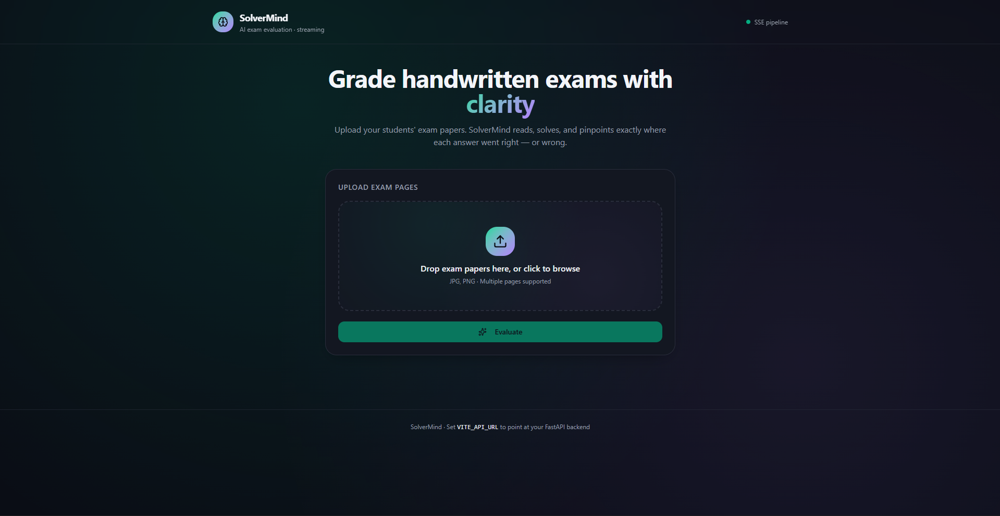

# 🎓 SolverMind — AI Homework Grader

<div align="center">

**An AI-powered pipeline that reads handwritten homework, solves it independently, and grades the student's work — with real-time SSE streaming.**

[](https://www.python.org/)
[](https://langchain-ai.github.io/langgraph/)
[](https://fastapi.tiangolo.com)
[](https://e2b.dev)
[](https://docs.pydantic.dev/)
[](LICENSE)

</div>

---

## 📺 Demo

> Three example runs: time-complexity analysis (substitution method), SFD/BMD beam calculation, and minimum spanning tree (graph theory).

<div align="center">
  <a href="https://drive.google.com/file/d/1XQJOOj4hM15nqktSWn7UgEewCxkYOQwm/view?usp=sharing" target="_blank">
    
  </a>
  <br/>
  <sub>▶ Click to watch the demo video</sub>
</div>

---

## 📌 What is This?

**SolverMind** is a production-grade LangGraph pipeline that acts as an AI Teaching Assistant. Upload a photo of handwritten homework — the system OCRs it, parses the problem domain automatically, solves it from scratch using SymPy or sandboxed Python execution, and produces a structured grading report comparing the student's work against the correct solution.

It supports **any math or CS subject** — not just one domain:

| Domain | Solver Strategy | Example |
|---|---|---|
| Beam Reactions & SFD/BMD | Pure SymPy (analytical) with dynamic units | Simply supported beam with UDL + point loads |
| Moment of Inertia | Pure SymPy (analytical) | Rectangle, I-section, hollow circle |
| Graph Theory (CSE) | LLM code-gen → E2B sandbox (NetworkX) | MST, shortest path, BFS/DFS |
| **Any other math** | LLM code-gen → E2B sandbox (sympy/numpy/scipy) | Calculus, algebra, recurrences, statistics |

---

## 🏗️ Architecture

```
User uploads homework image(s)
     │
     ▼
┌──────────────────────────────────────────────────────────────────┐
│                    LangGraph Pipeline                            │
│                                                                  │
│  ┌──────────┐      ┌──────────────┐      ┌──────────────┐      │
│  │ node_ocr │─────▶│ node_solver  │─────▶│ node_critic  │      │
│  │          │      │              │      │              │      │
│  │ Chandra  │      │ 2a: Universal│      │ Structured   │      │
│  │ OCR API  │      │    Parser    │      │ LLM grading  │      │
│  │          │      │ 2b: Dispatch │      │ (Pydantic)   │      │
│  └──────────┘      │    Solver    │      └──────────────┘      │
│       │            └──────────────┘             │               │
│       │ error?            │                     │               │
│       └──► END            ▼                     ▼               │
│                    ┌─────────────┐        SSE event:            │
│                    │ SymPy  E2B  │        pipeline_complete     │
│                    │ beam   sandbox│                             │
│                    │ MoI    (any) │                              │
│                    └─────────────┘                               │
└──────────────────────────────────────────────────────────────────┘
     │
     ▼
SSE Stream → Frontend (node-by-node progress)
```

**Key design decisions:**

- **Nodes, not tools.** The pipeline always runs OCR → Solver → Critic in sequence — deterministic stages, not LLM-chosen tool calls.
- **Shared state.** Every node reads from and writes to a `HWGraderState` TypedDict. LangGraph merges each node's partial return automatically.
- **Pydantic everywhere.** Every node boundary is a validated Pydantic model (`OCRResult`, `ParsedProblem`, `SolverResult`, `CriticOutput`) — deterministic contracts ready for FastAPI serialisation.
- **Dynamic units.** The parser extracts force/moment/length units from the OCR text. The beam solver uses these instead of hardcoded kN/m — so problems in lb/ft or N/mm work correctly.

---

## 🔬 Example Run

Handwritten recurrence analysis (substitution method) — graded in 30 seconds:

```
[Node 1/3] OCR — Chandra hosted API
   Pages: 1  |  Chars: 1152  |  14.4s

[Node 2/3] Parser + Solver
   Problem type : other (algorithm_analysis)
   Solver       : E2B sandbox (69 lines of Python generated)

   Execution Output:
   T(n) = 3T(n/2) + cn²
   Pattern: T(n) = 3^i T(n/2^i) + cn² Σ(3/4)^j
   3^(log₂n) = n^(log₂3), and log₂3 < 2, so n² dominates.
   FINAL ANSWER: Θ(n²)                                       25.1s

[Node 3/3] Critic
   ✅ PASS — Student's answer Θ(n²) matches correct solution.
   Notes: Intermediate algebra has a notation slip (3^log₂n
          written as n·log₂3) but final classification is correct
          — not penalised under grading rules.                30.2s
```

---

## 🔍 OCR: Why Chandra?

The pipeline uses [Chandra OCR 2](https://github.com/datalab-to/chandra-ocr-2) (hosted API) for handwriting extraction. During development, Mistral's latest OCR model was also tested — **Chandra consistently produced better accuracy** on handwritten mathematical notation, particularly with subscripts, superscripts, and structural formulas.

That said, no OCR model is perfect on noisy handwriting. Misreads happen — and when they do, the downstream LLM critic may flag a "student error" that is actually an OCR artefact. This leads to **false positives** (marking correct work as wrong).

This is a deliberate trade-off and arguably a feature:

- The critic always reports the **exact step and expression** where the discrepancy was found — a teacher can locate and verify it on the physical paper in seconds.
- **False positives are preferable to false negatives** in a grading context. A system that occasionally flags correct work for human review is far safer than one that occasionally lets errors slip through.
- The critic's grading rules explicitly include "OCR doubt before student doubt" — if there's ambiguity, it's flagged as a note rather than a hard failure.

This makes SolverMind well-suited as a **personal AI TA or grading assistant** for professors handling large volumes of exam papers with complex engineering mathematics — not as a replacement for human judgment, but as a first-pass filter that dramatically reduces the manual review surface.

---

## 📡 SSE Streaming Protocol

The `/grade` endpoint streams real-time progress as each pipeline node completes.

```
POST /grade
Content-Type: multipart/form-data
Response: text/event-stream
```

| Event | When | Key Fields |
|---|---|---|
| `node_complete` | After each node (×3) | `node`, `status`, `elapsed_seconds`, `data` |
| `pipeline_complete` | All nodes succeed | `critic_result`, `solver_steps`, `total_seconds` |
| `pipeline_error` | Any node fails | `error`, `total_seconds` |

```
event: node_complete
data: {"node":"ocr","status":"success","data":{"page_count":1,"char_count":1152},"elapsed_seconds":14.4}

event: node_complete
data: {"node":"solver","status":"success","data":{"problem_type":"other","units":{"force":"kN","moment":"kN.m","length":"m"}},"elapsed_seconds":25.1}

event: node_complete
data: {"node":"critic","status":"success","data":{"grade":"Pass","error_type":"None"},"elapsed_seconds":30.2}

event: pipeline_complete
data: {"status":"success","total_seconds":30.2,"critic_result":{...},"solver_steps":"..."}
```

---

## 📁 Project Structure

```
solverMind/
├── assets/                          # README screenshots
│   └── interface.png
├── examples/                        # Sample homework images for testing
│   ├── substitution.jpeg            # Time complexity (recurrence relation)
│   ├── SFD_BMD.jpeg                 # Beam reactions + shear/moment diagrams
│   ├── MST.jpeg                     # Minimum spanning tree (graph theory)
│   └── MST_q.png                    # MST problem statement
├── backend/                         # FastAPI production backend
│   ├── nodes/
│   │   ├── ocr.py                   # Node 1: Chandra API → OCRResult
│   │   ├── parser.py                # Universal parser (domain-agnostic)
│   │   ├── solver.py                # Node 2: dispatch → SolverResult
│   │   └── critic.py                # Node 3: structured grading → CriticOutput
│   ├── solvers/
│   │   ├── beam_reactions.py        # SymPy beam solver (dynamic units)
│   │   ├── moment_of_inertia.py     # SymPy MoI solver
│   │   └── e2b_unified.py           # Unified E2B sandbox (graph theory + other)
│   ├── services/
│   │   └── ocr_api.py               # Chandra API client (async + sync)
│   ├── __init__.py
│   ├── main.py                      # FastAPI app — SSE + sync endpoints
│   ├── config.py                    # pydantic-settings + load_dotenv()
│   ├── schemas.py                   # 12 Pydantic models (production contracts)
│   ├── state.py                     # HWGraderState TypedDict
│   ├── graph.py                     # LangGraph build + compile
│   └── .env.example
├── math_tutor_langgraph.ipynb       # Jupyter notebook (development version)
└── requirements.txt
```

---

## ⚙️ Tech Stack

| Layer | Technology |
|---|---|
| Pipeline Framework | [LangGraph](https://langchain-ai.github.io/langgraph/) (StateGraph) |
| LLM | OpenAI GPT (configurable — parser + critic use separate models) |
| OCR | [Chandra OCR 2](https://github.com/datalab-to/chandra-ocr-2) (hosted API) |
| Symbolic Math | SymPy (beam reactions, moment of inertia) |
| Code Execution | [E2B](https://e2b.dev) sandboxed interpreter (graph theory, general math) |
| Backend API | FastAPI + Uvicorn |
| Streaming | Server-Sent Events (SSE) |
| Data Validation | Pydantic v2 (every node boundary) |
| Configuration | pydantic-settings + python-dotenv |

---

## 🛠️ Local Setup

### Prerequisites

- Python 3.11+
- OpenAI API key
- [Chandra OCR API key](https://www.datalab.to/) (free tier available)
- [E2B API key](https://e2b.dev) (free tier available — needed for graph theory / general math)

### 1. Clone the repository

```bash
git clone https://github.com/FahimS45/solverMind.git
cd solverMind
```

### 2. Install dependencies

```bash
pip install -r requirements.txt
```

### 3. Configure environment variables

```bash
cd backend
cp .env.example .env
```

Open `.env` and fill in your keys:

```env
OPENAI_API_KEY=sk-...
CHANDRA_API_KEY=your-chandra-key
E2B_API_KEY=your-e2b-key
```

### 4. Start the server

```bash
# From the backend/ directory
python -m main
```

The API will be live at `http://localhost:8000`
Interactive docs at `http://localhost:8000/docs`

### 5. Test with an example image

```bash
curl -X POST http://localhost:8000/grade \
  -F "files=@../examples/substitution.jpeg"
```

---

## 📡 API Reference

| Method | Endpoint | Description |
|--------|----------|-------------|
| `POST` | `/grade` | SSE stream — real-time node-by-node progress |
| `POST` | `/grade/sync` | JSON response — blocking, returns final result |
| `GET` | `/health` | Readiness check — model and service status |

---

## 🔑 Environment Variables

| Variable | Required | Default | Description |
|---|---|---|---|
| `OPENAI_API_KEY` | ✅ | — | OpenAI API key |
| `CHANDRA_API_KEY` | ✅ | — | Chandra OCR hosted API key |
| `E2B_API_KEY` | ✅ | — | E2B sandbox API key |
| `PARSER_MODEL` | | `gpt-5.4-mini-2026-03-17` | LLM for problem parsing |
| `CRITIC_MODEL` | | `gpt-5.4-2026-03-05` | LLM for grading |
| `HOST` | | `0.0.0.0` | Server bind address |
| `PORT` | | `8000` | Server port |
| `CORS_ORIGINS` | | `["http://localhost:3000", ...]` | Allowed frontend origins |

---

## 🤝 Contributing

1. Fork the repository
2. Create a feature branch: `git checkout -b feature/your-feature`
3. Commit your changes: `git commit -m 'Add some feature'`
4. Push to the branch: `git push origin feature/your-feature`
5. Open a Pull Request

---

## 📄 License

This project is licensed under the MIT License — see the [LICENSE](LICENSE) file for details.

---

<div align="center">
  <sub>Built with ❤️ using LangGraph · FastAPI · SymPy · E2B · Chandra OCR · OpenAI</sub>
</div>
